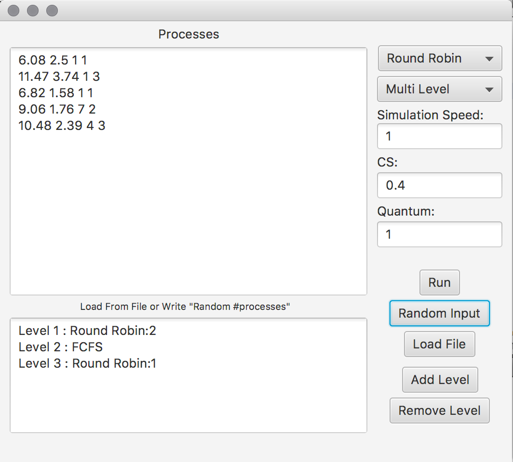
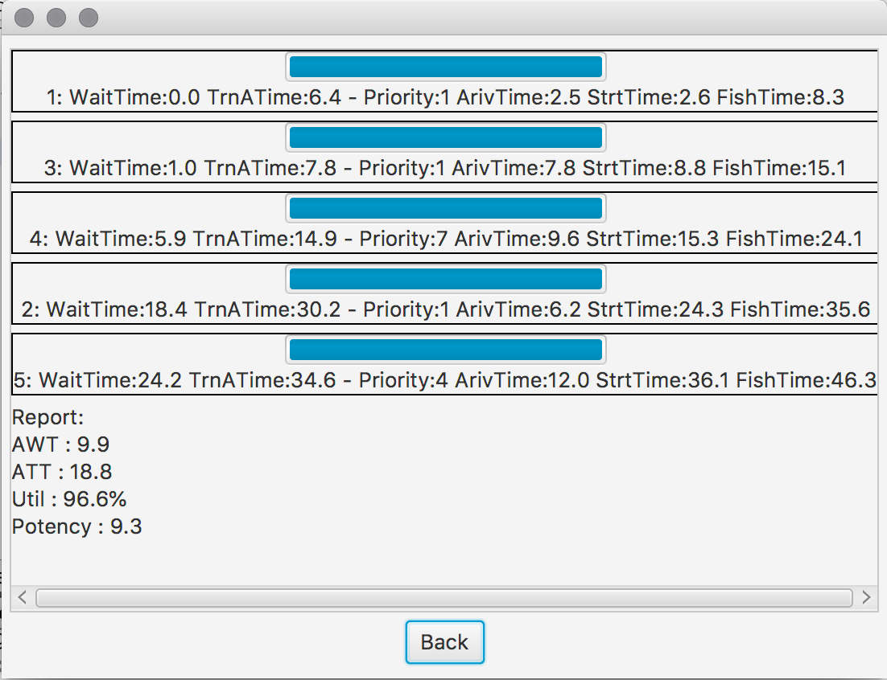
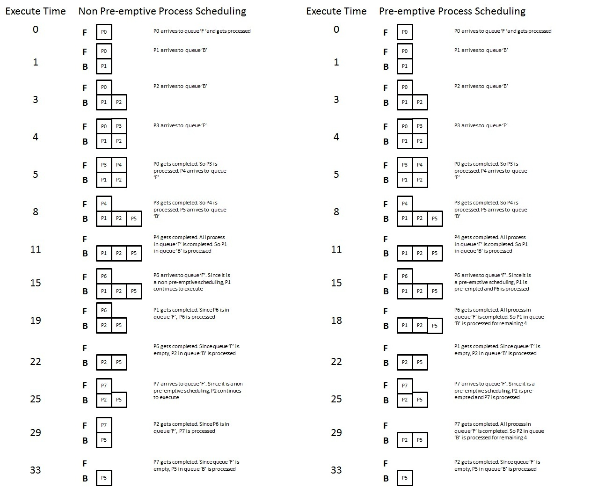
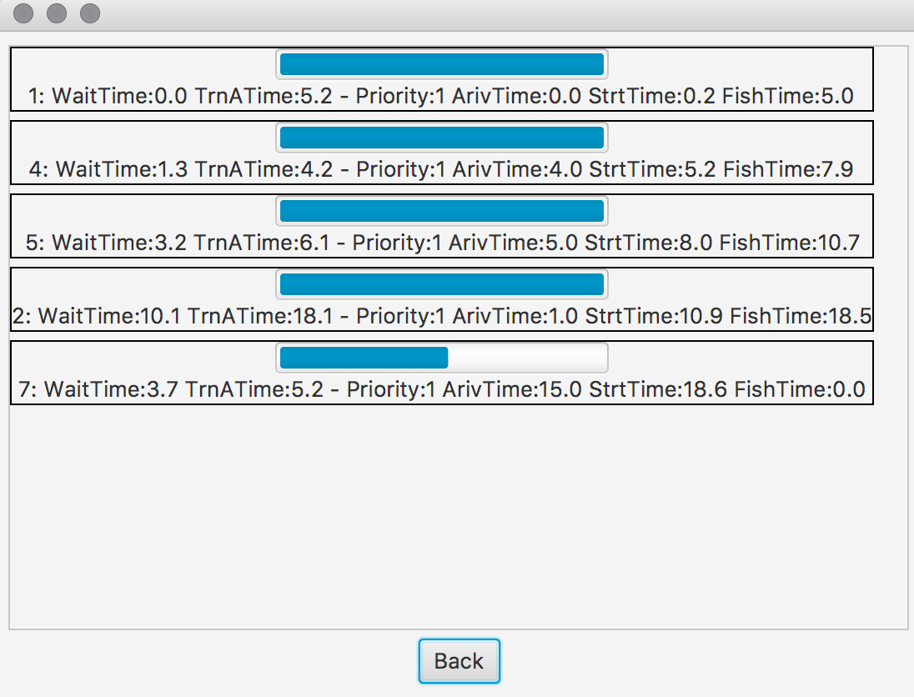
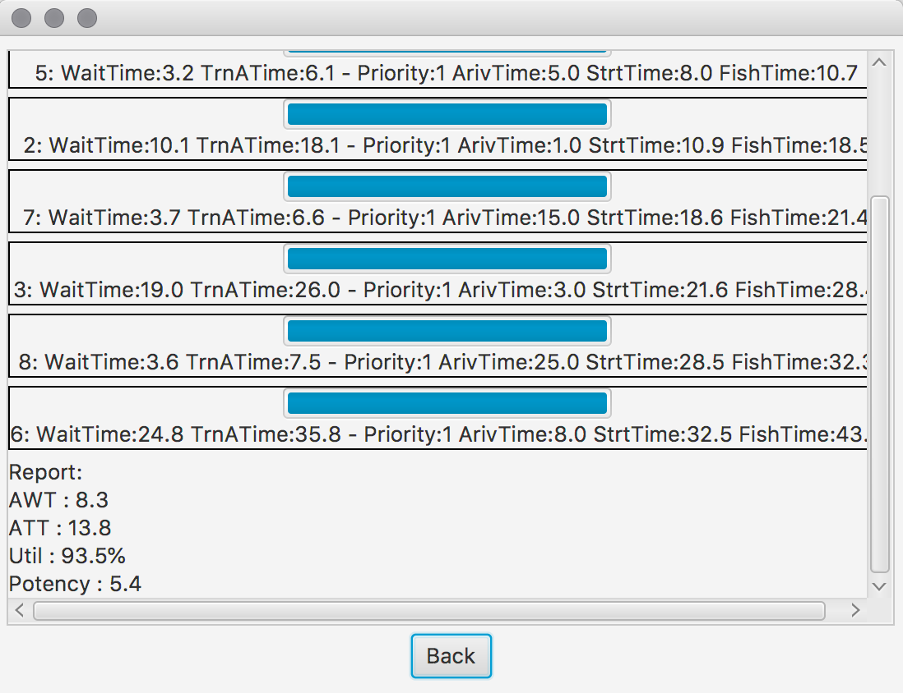

# CPU-Scheduler
> simulating scheduling algorithms of operating system for processes e.g. Priority Scheduling, Multi Level Scheduling, ...

*
*   @ASCK-TEAM
*

## Getting Started
This repository exposed here, is actually a university project of the course `operating system`

And implemented with `Java` language.

    
## Documentation 

The hierarchy display of the classes is demonstrated here:

----cpuscheduler

-----------| 

-----------src

------------------|

------------------Process                //data of each process e.g. start time, burst time, ...

------------------CPU                    //cpu for simulating schedule

------------------Scheduler              //abstract class for primitive methods and fields

------------------Sch_FCFS               //First Come First Serve Scheduler

------------------Sch_SJF                //Shortest Job First Scheduler (can be preemptive)

------------------Sch_Priority           //Priority Scheduler (can be preemptive)

------------------Sch_RR                 //Round Robin Scheduler 

------------------Sch_Lottery            //Lottery Scheduler

------------------Sch_Multilevel         //Multi Level Scheduler (can be preemptive)

------------------FXMLDocumentController //controller for main gui 

------------------SimulationController   //controller for simulation gui 

----/

- Process: either a process is executing or waiting these 2 states are handled in:
    - executing(double timeNow) : consume burst time and check if process is arrived or finished.
    - waiting(double timeNow) : add to waiting time

- CPU: 
    - first all process get initialize and added to allProc and procQueue ArrayList
    - then in Simulate() cpu checks if any process if it's arrived or not then add it to readyQueue
    - then depend on the scheduler next ready process will go on cpu
    - then cpu refresh its procQueue and readyQueue to remove finished processes
    - at last cpu save the report for simulation gui and reset all scheduler data
    
- Scheduler:
    - depend on the scheduler method return next process to go on cpu
    - Sch_FCFS: Priority Queue on arrival time
    - Sch_SJF: Priority Queue on burst time if preemptive is true always check for shorter burst time in queue
    - Sch_Priority: Priority Queue on priority if preemptive is true always check for shorter burst time in queue
    - Sch_RR: Priority Queue on arrival time and have additional RR list for switching between arrived processes in quantum time interval
    - Sch_Lottery: Random List of processes
    - Sch_Multilevel: List of scheduler levels return next process depend on scheduler method of first non-empty level if preemptive is true always check for non-empty levels first

> NOTES

***Note that simulation time unit is 0.1 so burst time or delay time must be multiple of 0.1***

***Note that order of each line specifies order of process arrival***

***Note that input format is like this for each line (Burst Time, Delay Time, Priority, Level)***

  - Burst Time : the duration for which a process gets control of the CPU.
  - Delay Time : the duration for which a process takes to come after the previous process for example: first process delay time is 1 so it will arrive at time 1 and second process delay time is 3 so it will arrive at time 4.
  - Priority : priority of a process (for Priority and Lottery Scheduler but it can't be omitted from input)
  - Level : level of a process (for Multi Level Scheduler but it can't be omitted from input)

***Note that minimum duration of context switch in this simulation is 0.4***

***Note that minimum duration of quantum for round robbin scheduler in this simulation is 0.2 because time unit is 0.1 and quantum can't be less than time unit***

 

## Results

Input Tabel:

| Process Name  | Arrival Time  | Execute Time  | Level         |
| ------------- | ------------- | ------------- | ------------- |
| 1             | 0             | 5             | 1             |
| 2             | 1             | 8             | 2             |
| 3             | 3             | 7             | 2             |
| 4             | 4             | 3             | 1             |
| 5             | 5             | 3             | 1             |
| 6             | 8             | 11            | 2             |
| 7             | 15            | 3             | 1             |
| 8             | 25            | 4             | 1             |

**For Example we are Scheduling process in Multi Level non-preemptive(l1:FCFS, l2 FCFS) below (input.txt file)**

**First we enter process information and choose scheduling alghorithm then press Run button**

**Wait for simulation to end**

**Now you can see the results**

## Authors

  - Soheil Changizi ( [@cocolico14](https://github.com/cocolico14) )
  - Alireza Kavian ( [@alirezakay](https://github.com/alirezakay) )
  
## Org.

  - ***[Brilacasck](https://brilacasck.ir)*** 
  
## Team
  
  - ***ASCK TEAM***

## License

This project is licensed under the MIT License - see the [LICENSE](./LICENSE) file for details

